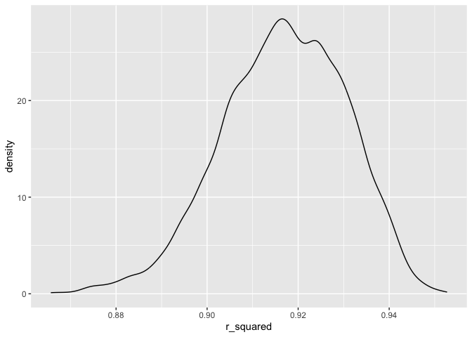
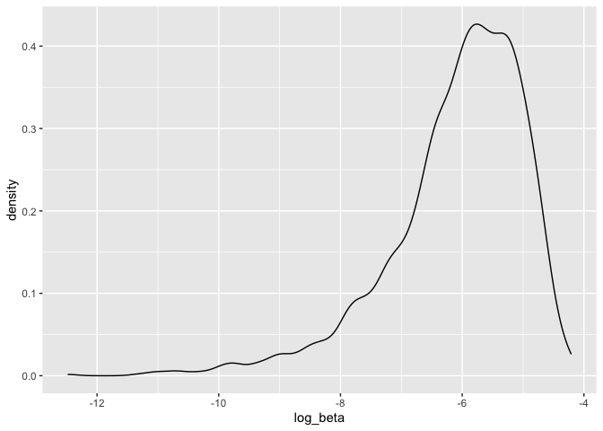
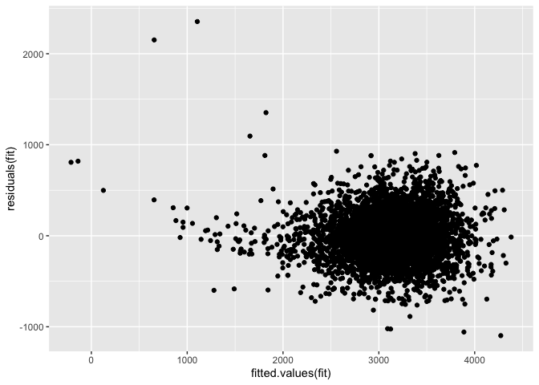
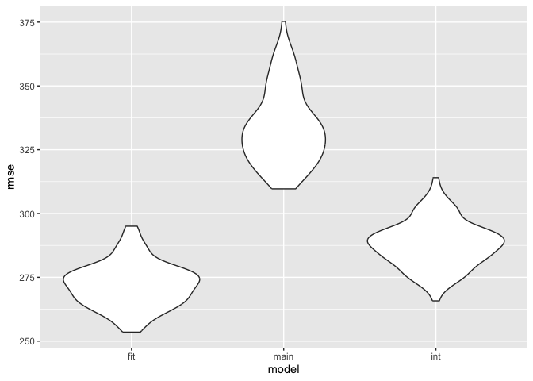

hw6
================
2023-11-29

``` r
library(tidyverse)
```

    ## ── Attaching core tidyverse packages ──────────────────────── tidyverse 2.0.0 ──
    ## ✔ dplyr     1.1.4     ✔ readr     2.1.4
    ## ✔ forcats   1.0.0     ✔ stringr   1.5.1
    ## ✔ ggplot2   3.4.4     ✔ tibble    3.2.1
    ## ✔ lubridate 1.9.3     ✔ tidyr     1.3.0
    ## ✔ purrr     1.0.2     
    ## ── Conflicts ────────────────────────────────────────── tidyverse_conflicts() ──
    ## ✖ dplyr::filter() masks stats::filter()
    ## ✖ dplyr::lag()    masks stats::lag()
    ## ℹ Use the conflicted package (<http://conflicted.r-lib.org/>) to force all conflicts to become errors

``` r
library(p8105.datasets)
library(modelr)
library(mgcv)
```

    ## Loading required package: nlme
    ## 
    ## Attaching package: 'nlme'
    ## 
    ## The following object is masked from 'package:dplyr':
    ## 
    ##     collapse
    ## 
    ## This is mgcv 1.9-0. For overview type 'help("mgcv-package")'.

``` r
set.seed(1)
```

# Problem 1

In the data cleaning code below we create a `city_state` variable,
change `victim_age` to numeric, modifiy victim_race to have categories
white and non-white, with white as the reference category, and create a
`resolution` variable indicating whether the homicide is solved. Lastly,
we filtered out the following cities: Tulsa, AL; Dallas, TX; Phoenix,
AZ; and Kansas City, MO; and we retained only the variables
`city_state`, `resolution`, `victim_age`, `victim_sex`, and
`victim_race`.

``` r
homicide_df = 
  read_csv("data/homicide-data.csv", na = c("", "NA", "Unknown")) |> 
  mutate(
    city_state = str_c(city, state, sep = ", "),
    victim_age = as.numeric(victim_age),
    resolution = case_when(
      disposition == "Closed without arrest" ~ 0,
      disposition == "Open/No arrest"        ~ 0,
      disposition == "Closed by arrest"      ~ 1)
  ) |> 
  filter(victim_race %in% c("White", "Black")) |> 
  filter(!(city_state %in% c("Tulsa, AL", "Dallas, TX", "Phoenix, AZ", "Kansas City, MO"))) |> 
  select(city_state, resolution, victim_age, victim_sex, victim_race)
```

    ## Rows: 52179 Columns: 12
    ## ── Column specification ────────────────────────────────────────────────────────
    ## Delimiter: ","
    ## chr (8): uid, victim_last, victim_first, victim_race, victim_sex, city, stat...
    ## dbl (4): reported_date, victim_age, lat, lon
    ## 
    ## ℹ Use `spec()` to retrieve the full column specification for this data.
    ## ℹ Specify the column types or set `show_col_types = FALSE` to quiet this message.

Next we fit a logistic regression model using only data from Baltimore,
MD. We model `resolved` as the outcome and `victim_age`, `victim_sex`,
and `victim_race` as predictors. We save the output as `baltimore_glm`
so that we can apply `broom::tidy` to this object and obtain the
estimate and confidence interval of the adjusted odds ratio for solving
homicides comparing non-white victims to white victims.

``` r
baltimore_glm = 
  filter(homicide_df, city_state == "Baltimore, MD") |> 
  glm(resolution ~ victim_age + victim_sex + victim_race, family = binomial(), data = _)

baltimore_glm |> 
  broom::tidy() |> 
  mutate(
    OR = exp(estimate), 
    OR_CI_upper = exp(estimate + 1.96 * std.error),
    OR_CI_lower = exp(estimate - 1.96 * std.error)) |> 
  filter(term == "victim_sexMale") |> 
  select(OR, OR_CI_lower, OR_CI_upper) |>
  knitr::kable(digits = 3)
```

|    OR | OR_CI_lower | OR_CI_upper |
|------:|------------:|------------:|
| 0.426 |       0.325 |       0.558 |

Below, by incorporating `nest()`, `map()`, and `unnest()` into the
preceding Baltimore-specific code, we fit a model for each of the
cities, and extract the adjusted odds ratio (and CI) for solving
homicides comparing non-white victims to white victims. We show the
first 5 rows of the resulting dataframe of model results.

``` r
model_results = 
  homicide_df |> 
  nest(data = -city_state) |> 
  mutate(
    models = map(data, \(df) glm(resolution ~ victim_age + victim_sex + victim_race, 
                             family = binomial(), data = df)),
    tidy_models = map(models, broom::tidy)) |> 
  select(-models, -data) |> 
  unnest(cols = tidy_models) |> 
  mutate(
    OR = exp(estimate), 
    OR_CI_upper = exp(estimate + 1.96 * std.error),
    OR_CI_lower = exp(estimate - 1.96 * std.error)) |> 
  filter(term == "victim_sexMale") |> 
  select(city_state, OR, OR_CI_lower, OR_CI_upper)

model_results |>
  slice(1:5) |> 
  knitr::kable(digits = 3)
```

| city_state      |    OR | OR_CI_lower | OR_CI_upper |
|:----------------|------:|------------:|------------:|
| Albuquerque, NM | 1.767 |       0.831 |       3.761 |
| Atlanta, GA     | 1.000 |       0.684 |       1.463 |
| Baltimore, MD   | 0.426 |       0.325 |       0.558 |
| Baton Rouge, LA | 0.381 |       0.209 |       0.695 |
| Birmingham, AL  | 0.870 |       0.574 |       1.318 |

Below we generate a plot of the estimated ORs and CIs for each city,
ordered by magnitude of the OR from smallest to largest. From this plot
we see that most cities have odds ratios that are smaller than 1,
suggesting that crimes with male victims have smaller odds of resolution
compared to crimes with female victims after adjusting for victim age
and race. This disparity is strongest in New yrok. In roughly half of
these cities, confidence intervals are narrow and do not contain 1,
suggesting a significant difference in resolution rates by sex after
adjustment for victim age and race.

``` r
model_results |> 
  mutate(city_state = fct_reorder(city_state, OR)) |> 
  ggplot(aes(x = city_state, y = OR)) + 
  geom_point() + 
  geom_errorbar(aes(ymin = OR_CI_lower, ymax = OR_CI_upper)) + 
  theme(axis.text.x = element_text(angle = 90, hjust = 1))
```

<!-- -->

# Problem 2

``` r
weather_df = 
  rnoaa::meteo_pull_monitors(
    c("USW00094728"),
    var = c("PRCP", "TMIN", "TMAX"), 
    date_min = "2022-01-01",
    date_max = "2022-12-31") |>
  mutate(
    name = recode(id, USW00094728 = "CentralPark_NY"),
    tmin = tmin / 10,
    tmax = tmax / 10) |>
  select(name, id, everything())
```

``` r
lm(tmax ~ tmin + prcp, data = weather_df)
```

    ## 
    ## Call:
    ## lm(formula = tmax ~ tmin + prcp, data = weather_df)
    ## 
    ## Coefficients:
    ## (Intercept)         tmin         prcp  
    ##    8.042803     1.013386    -0.001541

``` r
boot_sample = function(df) {
  sample_frac(df, replace=TRUE)
}

boot_straps = 
  tibble(strap_number = 1:5000) %>% 
  mutate(
    strap_sample = map(strap_number, ~boot_sample(df = weather_df))
  )

boot_straps %>% 
  slice(1:3) %>% 
  mutate(strap_sample = map(strap_sample, arrange, tmax)) %>%  
  pull(strap_sample)
```

    ## [[1]]
    ## # A tibble: 365 × 6
    ##    name           id          date        prcp  tmax  tmin
    ##    <chr>          <chr>       <date>     <dbl> <dbl> <dbl>
    ##  1 CentralPark_NY USW00094728 2022-12-24     0  -9.3 -13.8
    ##  2 CentralPark_NY USW00094728 2022-12-24     0  -9.3 -13.8
    ##  3 CentralPark_NY USW00094728 2022-01-15     0  -6   -12.1
    ##  4 CentralPark_NY USW00094728 2022-01-21     0  -5.5  -9.9
    ##  5 CentralPark_NY USW00094728 2022-02-14     0  -3.8  -8.8
    ##  6 CentralPark_NY USW00094728 2022-02-14     0  -3.8  -8.8
    ##  7 CentralPark_NY USW00094728 2022-02-05     0  -2.7  -7.1
    ##  8 CentralPark_NY USW00094728 2022-12-25     0  -2.1  -9.9
    ##  9 CentralPark_NY USW00094728 2022-12-25     0  -2.1  -9.9
    ## 10 CentralPark_NY USW00094728 2022-01-22     0  -1.6 -10.5
    ## # ℹ 355 more rows
    ## 
    ## [[2]]
    ## # A tibble: 365 × 6
    ##    name           id          date        prcp  tmax  tmin
    ##    <chr>          <chr>       <date>     <dbl> <dbl> <dbl>
    ##  1 CentralPark_NY USW00094728 2022-01-11     0  -4.3  -9.3
    ##  2 CentralPark_NY USW00094728 2022-01-11     0  -4.3  -9.3
    ##  3 CentralPark_NY USW00094728 2022-02-14     0  -3.8  -8.8
    ##  4 CentralPark_NY USW00094728 2022-01-30     0  -3.2 -11  
    ##  5 CentralPark_NY USW00094728 2022-02-05     0  -2.7  -7.1
    ##  6 CentralPark_NY USW00094728 2022-02-05     0  -2.7  -7.1
    ##  7 CentralPark_NY USW00094728 2022-12-26     0  -1.6  -7.7
    ##  8 CentralPark_NY USW00094728 2022-01-08     0  -1    -6.6
    ##  9 CentralPark_NY USW00094728 2022-01-08     0  -1    -6.6
    ## 10 CentralPark_NY USW00094728 2022-01-31     0  -0.5  -6  
    ## # ℹ 355 more rows
    ## 
    ## [[3]]
    ## # A tibble: 365 × 6
    ##    name           id          date        prcp  tmax  tmin
    ##    <chr>          <chr>       <date>     <dbl> <dbl> <dbl>
    ##  1 CentralPark_NY USW00094728 2022-01-21     0  -5.5  -9.9
    ##  2 CentralPark_NY USW00094728 2022-01-11     0  -4.3  -9.3
    ##  3 CentralPark_NY USW00094728 2022-02-14     0  -3.8  -8.8
    ##  4 CentralPark_NY USW00094728 2022-02-14     0  -3.8  -8.8
    ##  5 CentralPark_NY USW00094728 2022-02-05     0  -2.7  -7.1
    ##  6 CentralPark_NY USW00094728 2022-01-26     0  -2.1  -6.6
    ##  7 CentralPark_NY USW00094728 2022-01-29   196  -1.6 -11  
    ##  8 CentralPark_NY USW00094728 2022-01-22     0  -1.6 -10.5
    ##  9 CentralPark_NY USW00094728 2022-01-08     0  -1    -6.6
    ## 10 CentralPark_NY USW00094728 2022-02-15     0  -1    -8.8
    ## # ℹ 355 more rows

``` r
bootstrap_results = 
  boot_straps %>% 
  mutate(
    models = map(strap_sample, ~lm(tmax ~ tmin + prcp, data = .)
  ), 
    results = map(models, broom::tidy),
    r_squared = map_dbl(models, ~broom::glance(.x)$r.squared),
    log_beta = map_dbl(models, ~ {
      coef <- coefficients(.x)
      if (coef[2] * coef[3] >= 0) log(coef[2] * coef[3]) else NA_real_
    })
  ) %>% 
  select(-strap_sample, -models) %>% 
  unnest(results)
```

## Plotting the distributions of estimates for r_squared and log_beta

``` r
estimate_plot_rs = 
bootstrap_results %>% 
  ggplot(aes(x = r_squared)) + geom_density()

estimate_plot_rs
```

<!-- -->

The distribution of the r sqaured estimates appears approximately normal
but may have a slight left skew. This slight skew is likely due to
random sampling variability.

``` r
estimate_plot_log = 
bootstrap_results %>% 
  ggplot(aes(x = log_beta)) + geom_density()

estimate_plot_log
```

    ## Warning: Removed 10083 rows containing non-finite values (`stat_density()`).

<!-- -->

The distribution of the log(beta_1\*beta_2) estimates is strongly left
skewed. This may be due to the fact that there were several negative
beta estimates that could not be used in the log calculations,
indicating that this may not be representative of the dataset the
bootstrap was performed on.

## Identifying 95% Confidence Intervals

``` r
bootstrap_results %>%  
  summarize(
    ci_lower = quantile(r_squared, 0.025), 
    ci_upper = quantile(r_squared, 0.975))
```

    ## # A tibble: 1 × 2
    ##   ci_lower ci_upper
    ##      <dbl>    <dbl>
    ## 1    0.889    0.941

We are 95% confident that the true r-squared value is between 0.889 and
0.941.

``` r
bootstrap_results %>%  
  summarize(
    ci_lower = quantile(log_beta, 0.025, na.rm = TRUE), 
    ci_upper = quantile(log_beta, 0.975, na.rm = TRUE))
```

    ## # A tibble: 1 × 2
    ##   ci_lower ci_upper
    ##      <dbl>    <dbl>
    ## 1    -8.98    -4.60

We are 95% confident that the true log(beta_1\*beta_2) value is between
-8.98 and -4.60.

# Problem 3

## Tidying the data

``` r
birthweight_df = 
  read_csv("data/birthweight.csv") %>% 
  janitor::clean_names() %>% 
  mutate(across(c(babysex, frace, malform, mrace), as_factor)) %>% 
  select(-pnumsga, -pnumlbw)
```

    ## Rows: 4342 Columns: 20
    ## ── Column specification ────────────────────────────────────────────────────────
    ## Delimiter: ","
    ## dbl (20): babysex, bhead, blength, bwt, delwt, fincome, frace, gaweeks, malf...
    ## 
    ## ℹ Use `spec()` to retrieve the full column specification for this data.
    ## ℹ Specify the column types or set `show_col_types = FALSE` to quiet this message.

``` r
missing_val_check = 
  birthweight_df %>% 
  summarise_all(~sum(is.na(.)))
```

## Regression model

``` r
all_fit = lm(bwt~ ., data = birthweight_df)

step(all_fit, direction = "both")
```

    ## Start:  AIC=48717.83
    ## bwt ~ babysex + bhead + blength + delwt + fincome + frace + gaweeks + 
    ##     malform + menarche + mheight + momage + mrace + parity + 
    ##     ppbmi + ppwt + smoken + wtgain
    ## 
    ## 
    ## Step:  AIC=48717.83
    ## bwt ~ babysex + bhead + blength + delwt + fincome + frace + gaweeks + 
    ##     malform + menarche + mheight + momage + mrace + parity + 
    ##     ppbmi + ppwt + smoken
    ## 
    ##            Df Sum of Sq       RSS   AIC
    ## - frace     4    124365 320848704 48712
    ## - malform   1      1419 320725757 48716
    ## - ppbmi     1      6346 320730684 48716
    ## - momage    1     28661 320752999 48716
    ## - mheight   1     66886 320791224 48717
    ## - menarche  1    111679 320836018 48717
    ## - ppwt      1    131132 320855470 48718
    ## <none>                  320724338 48718
    ## - fincome   1    193454 320917792 48718
    ## - parity    1    413584 321137922 48721
    ## - mrace     3    868321 321592659 48724
    ## - babysex   1    853796 321578134 48727
    ## - gaweeks   1   4611823 325336161 48778
    ## - smoken    1   5076393 325800732 48784
    ## - delwt     1   8008891 328733230 48823
    ## - blength   1 102050296 422774634 49915
    ## - bhead     1 106535716 427260054 49961
    ## 
    ## Step:  AIC=48711.51
    ## bwt ~ babysex + bhead + blength + delwt + fincome + gaweeks + 
    ##     malform + menarche + mheight + momage + mrace + parity + 
    ##     ppbmi + ppwt + smoken
    ## 
    ##            Df Sum of Sq       RSS   AIC
    ## - malform   1      1447 320850151 48710
    ## - ppbmi     1      6975 320855679 48710
    ## - momage    1     28379 320877083 48710
    ## - mheight   1     69502 320918206 48710
    ## - menarche  1    115708 320964411 48711
    ## - ppwt      1    133961 320982665 48711
    ## <none>                  320848704 48712
    ## - fincome   1    194405 321043108 48712
    ## - parity    1    414687 321263390 48715
    ## + frace     4    124365 320724338 48718
    ## - babysex   1    852133 321700837 48721
    ## - gaweeks   1   4625208 325473911 48772
    ## - smoken    1   5036389 325885093 48777
    ## - delwt     1   8013099 328861802 48817
    ## - mrace     3  13540415 334389119 48885
    ## - blength   1 101995688 422844392 49908
    ## - bhead     1 106662962 427511666 49956
    ## 
    ## Step:  AIC=48709.53
    ## bwt ~ babysex + bhead + blength + delwt + fincome + gaweeks + 
    ##     menarche + mheight + momage + mrace + parity + ppbmi + ppwt + 
    ##     smoken
    ## 
    ##            Df Sum of Sq       RSS   AIC
    ## - ppbmi     1      6928 320857079 48708
    ## - momage    1     28660 320878811 48708
    ## - mheight   1     69320 320919470 48708
    ## - menarche  1    116027 320966177 48709
    ## - ppwt      1    133894 320984044 48709
    ## <none>                  320850151 48710
    ## - fincome   1    193784 321043934 48710
    ## + malform   1      1447 320848704 48712
    ## - parity    1    414482 321264633 48713
    ## + frace     4    124393 320725757 48716
    ## - babysex   1    851279 321701430 48719
    ## - gaweeks   1   4624003 325474154 48770
    ## - smoken    1   5035195 325885346 48775
    ## - delwt     1   8029079 328879230 48815
    ## - mrace     3  13553320 334403471 48883
    ## - blength   1 102009225 422859375 49906
    ## - bhead     1 106675331 427525481 49954
    ## 
    ## Step:  AIC=48707.63
    ## bwt ~ babysex + bhead + blength + delwt + fincome + gaweeks + 
    ##     menarche + mheight + momage + mrace + parity + ppwt + smoken
    ## 
    ##            Df Sum of Sq       RSS   AIC
    ## - momage    1     29211 320886290 48706
    ## - menarche  1    117635 320974714 48707
    ## <none>                  320857079 48708
    ## - fincome   1    195199 321052278 48708
    ## + ppbmi     1      6928 320850151 48710
    ## + malform   1      1400 320855679 48710
    ## - parity    1    412984 321270064 48711
    ## + frace     4    125020 320732060 48714
    ## - babysex   1    850020 321707099 48717
    ## - mheight   1   1078673 321935752 48720
    ## - ppwt      1   2934023 323791103 48745
    ## - gaweeks   1   4621504 325478583 48768
    ## - smoken    1   5039368 325896447 48773
    ## - delwt     1   8024939 328882018 48813
    ## - mrace     3  13551444 334408523 48881
    ## - blength   1 102018559 422875638 49904
    ## - bhead     1 106821342 427678421 49953
    ## 
    ## Step:  AIC=48706.02
    ## bwt ~ babysex + bhead + blength + delwt + fincome + gaweeks + 
    ##     menarche + mheight + mrace + parity + ppwt + smoken
    ## 
    ##            Df Sum of Sq       RSS   AIC
    ## - menarche  1    100121 320986412 48705
    ## <none>                  320886290 48706
    ## - fincome   1    240800 321127090 48707
    ## + momage    1     29211 320857079 48708
    ## + ppbmi     1      7479 320878811 48708
    ## + malform   1      1678 320884612 48708
    ## - parity    1    431433 321317724 48710
    ## + frace     4    124743 320761547 48712
    ## - babysex   1    841278 321727568 48715
    ## - mheight   1   1076739 321963029 48719
    ## - ppwt      1   2913653 323799943 48743
    ## - gaweeks   1   4676469 325562760 48767
    ## - smoken    1   5045104 325931394 48772
    ## - delwt     1   8000672 328886962 48811
    ## - mrace     3  14667730 335554021 48894
    ## - blength   1 101990556 422876847 49902
    ## - bhead     1 106864308 427750598 49952
    ## 
    ## Step:  AIC=48705.38
    ## bwt ~ babysex + bhead + blength + delwt + fincome + gaweeks + 
    ##     mheight + mrace + parity + ppwt + smoken
    ## 
    ##            Df Sum of Sq       RSS   AIC
    ## <none>                  320986412 48705
    ## + menarche  1    100121 320886290 48706
    ## - fincome   1    245637 321232048 48707
    ## + momage    1     11698 320974714 48707
    ## + ppbmi     1      8823 320977589 48707
    ## + malform   1      1884 320984528 48707
    ## - parity    1    422770 321409181 48709
    ## + frace     4    128726 320857686 48712
    ## - babysex   1    846134 321832545 48715
    ## - mheight   1   1012240 321998651 48717
    ## - ppwt      1   2907049 323893461 48743
    ## - gaweeks   1   4662501 325648912 48766
    ## - smoken    1   5073849 326060260 48771
    ## - delwt     1   8137459 329123871 48812
    ## - mrace     3  14683609 335670021 48894
    ## - blength   1 102191779 423178191 49903
    ## - bhead     1 106779754 427766166 49950

    ## 
    ## Call:
    ## lm(formula = bwt ~ babysex + bhead + blength + delwt + fincome + 
    ##     gaweeks + mheight + mrace + parity + ppwt + smoken, data = birthweight_df)
    ## 
    ## Coefficients:
    ## (Intercept)     babysex2        bhead      blength        delwt      fincome  
    ##   -6098.822       28.558      130.777       74.947        4.107        0.318  
    ##     gaweeks      mheight       mrace2       mrace3       mrace4       parity  
    ##      11.592        6.594     -138.792      -74.887     -100.678       96.305  
    ##        ppwt       smoken  
    ##      -2.676       -4.843

``` r
fit = lm(bwt ~ babysex + bhead + blength + delwt + fincome + 
    gaweeks + mheight + mrace + parity + ppwt + smoken, data = birthweight_df)
```

Final model: lm( bwt ~ babysex + bhead + blength + delwt + fincome +
gaweeks + mheight + mrace + parity + ppwt + smoken, data =
birthweight_df)

I chose to use a stepwise compariosn of the model for the building
process to determine the final regression model. The final model is a
linear regression model that contains eleven predictors with the outcome
variable birthweight.

``` r
birthweight_df %>% 
  modelr::add_residuals(fit) %>% 
  modelr::add_predictions(fit) %>% 
  ggplot(aes(x = fitted.values(fit), y = residuals(fit))) + geom_point()
```

<!-- --> There does not
appear to be any distinct pattern in the residual plot.

## Cross Validation

Original model:

fit = lm(bwt ~ babysex + bhead + blength + delwt + fincome + gaweeks +
mheight + mrace + parity + ppwt + smoken, data = birthweight_df)

Comparison models:

fit_main = lm(bwt ~ blength + gaweeks, data = birthweight_df)

fit_int = lm(bwt ~ bhead + blength + babysex + babysex*bhead +
babysex*blength + bhead*blength + babysex*bhead\*blength, data =
birthweight_df)

``` r
fit_main = lm(bwt ~ blength + gaweeks, data = birthweight_df)

fit_int = lm(bwt ~ bhead + blength + babysex + babysex*bhead + babysex*blength + bhead*blength + babysex*bhead*blength, data = birthweight_df)
```

## CV plot

``` r
cv_df =
  crossv_mc(birthweight_df, 100) |> 
  mutate(
    train = map(train, as_tibble),
    test = map(test, as_tibble))

cv_df = 
  cv_df |> 
  mutate(
    fit = map(train, \(df) lm(bwt ~ babysex + bhead + blength + delwt + fincome + gaweeks + mheight + mrace + parity + ppwt + smoken, data = birthweight_df)),
    fit_main = map(train, \(df) lm(bwt ~ blength + gaweeks, data = birthweight_df)),
    fit_int  = map(train, \(df) lm(bwt ~ bhead + blength + babysex + babysex*bhead + babysex*blength + bhead*blength + babysex*bhead*blength, data = birthweight_df))) |> 
  mutate(
    rmse_fit = map2_dbl(fit, test, \(mod, df) rmse(model = mod, data = df)),
    rmse_main = map2_dbl(fit_main, test, \(mod, df) rmse(model = mod, data = df)),
    rmse_int = map2_dbl(fit_int, test, \(mod, df) rmse(model = mod, data = df)))

cv_df |> 
  select(starts_with("rmse")) |> 
  pivot_longer(
    everything(),
    names_to = "model", 
    values_to = "rmse",
    names_prefix = "rmse_") |> 
  mutate(model = fct_inorder(model)) |> 
  ggplot(aes(x = model, y = rmse)) + geom_violin()
```

<!-- -->

Looking at the prediction error distributions for all three mdoels, it
appears that the orginal model that I fitted is the best of the three
models. Second to this, I would use the third model that includes the
interaction terms. This is based on the most common rmse values for each
model as is seen in the violin plot above.
