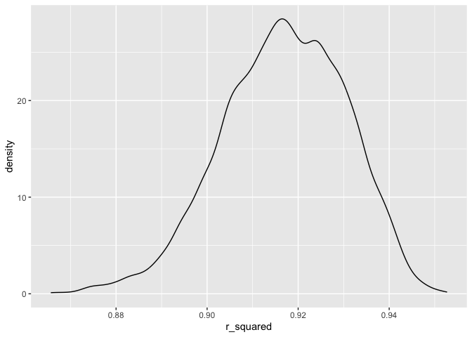

hw6
================
2023-11-29

# Problem 1

# Problem 2

``` r
weather_df = 
  rnoaa::meteo_pull_monitors(
    c("USW00094728"),
    var = c("PRCP", "TMIN", "TMAX"), 
    date_min = "2022-01-01",
    date_max = "2022-12-31") |>
  mutate(
    name = recode(id, USW00094728 = "CentralPark_NY"),
    tmin = tmin / 10,
    tmax = tmax / 10) |>
  select(name, id, everything())
```

``` r
lm(tmax ~ tmin + prcp, data = weather_df)
```

    ## 
    ## Call:
    ## lm(formula = tmax ~ tmin + prcp, data = weather_df)
    ## 
    ## Coefficients:
    ## (Intercept)         tmin         prcp  
    ##    8.042803     1.013386    -0.001541

``` r
boot_sample = function(df) {
  sample_frac(df, replace=TRUE)
}

boot_straps = 
  tibble(strap_number = 1:5000) %>% 
  mutate(
    strap_sample = map(strap_number, ~boot_sample(df = weather_df))
  )

boot_straps %>% 
  slice(1:3) %>% 
  mutate(strap_sample = map(strap_sample, arrange, tmax)) %>%  
  pull(strap_sample)
```

    ## [[1]]
    ## # A tibble: 365 × 6
    ##    name           id          date        prcp  tmax  tmin
    ##    <chr>          <chr>       <date>     <dbl> <dbl> <dbl>
    ##  1 CentralPark_NY USW00094728 2022-12-24     0  -9.3 -13.8
    ##  2 CentralPark_NY USW00094728 2022-12-24     0  -9.3 -13.8
    ##  3 CentralPark_NY USW00094728 2022-01-15     0  -6   -12.1
    ##  4 CentralPark_NY USW00094728 2022-01-21     0  -5.5  -9.9
    ##  5 CentralPark_NY USW00094728 2022-02-14     0  -3.8  -8.8
    ##  6 CentralPark_NY USW00094728 2022-02-14     0  -3.8  -8.8
    ##  7 CentralPark_NY USW00094728 2022-02-05     0  -2.7  -7.1
    ##  8 CentralPark_NY USW00094728 2022-12-25     0  -2.1  -9.9
    ##  9 CentralPark_NY USW00094728 2022-12-25     0  -2.1  -9.9
    ## 10 CentralPark_NY USW00094728 2022-01-22     0  -1.6 -10.5
    ## # ℹ 355 more rows
    ## 
    ## [[2]]
    ## # A tibble: 365 × 6
    ##    name           id          date        prcp  tmax  tmin
    ##    <chr>          <chr>       <date>     <dbl> <dbl> <dbl>
    ##  1 CentralPark_NY USW00094728 2022-01-11     0  -4.3  -9.3
    ##  2 CentralPark_NY USW00094728 2022-01-11     0  -4.3  -9.3
    ##  3 CentralPark_NY USW00094728 2022-02-14     0  -3.8  -8.8
    ##  4 CentralPark_NY USW00094728 2022-01-30     0  -3.2 -11  
    ##  5 CentralPark_NY USW00094728 2022-02-05     0  -2.7  -7.1
    ##  6 CentralPark_NY USW00094728 2022-02-05     0  -2.7  -7.1
    ##  7 CentralPark_NY USW00094728 2022-12-26     0  -1.6  -7.7
    ##  8 CentralPark_NY USW00094728 2022-01-08     0  -1    -6.6
    ##  9 CentralPark_NY USW00094728 2022-01-08     0  -1    -6.6
    ## 10 CentralPark_NY USW00094728 2022-01-31     0  -0.5  -6  
    ## # ℹ 355 more rows
    ## 
    ## [[3]]
    ## # A tibble: 365 × 6
    ##    name           id          date        prcp  tmax  tmin
    ##    <chr>          <chr>       <date>     <dbl> <dbl> <dbl>
    ##  1 CentralPark_NY USW00094728 2022-01-21     0  -5.5  -9.9
    ##  2 CentralPark_NY USW00094728 2022-01-11     0  -4.3  -9.3
    ##  3 CentralPark_NY USW00094728 2022-02-14     0  -3.8  -8.8
    ##  4 CentralPark_NY USW00094728 2022-02-14     0  -3.8  -8.8
    ##  5 CentralPark_NY USW00094728 2022-02-05     0  -2.7  -7.1
    ##  6 CentralPark_NY USW00094728 2022-01-26     0  -2.1  -6.6
    ##  7 CentralPark_NY USW00094728 2022-01-29   196  -1.6 -11  
    ##  8 CentralPark_NY USW00094728 2022-01-22     0  -1.6 -10.5
    ##  9 CentralPark_NY USW00094728 2022-01-08     0  -1    -6.6
    ## 10 CentralPark_NY USW00094728 2022-02-15     0  -1    -8.8
    ## # ℹ 355 more rows

``` r
bootstrap_results = 
  boot_straps %>% 
  mutate(
    models = map(strap_sample, ~lm(tmax ~ tmin + prcp, data = .)
  ), 
    results = map(models, broom::tidy),
    r_squared = map_dbl(models, ~broom::glance(.x)$r.squared),
    log_beta = map_dbl(models, ~ {
      coef <- coefficients(.x)
      if (coef[2] * coef[3] >= 0) log(coef[2] * coef[3]) else NA_real_
    })
  ) %>% 
  select(-strap_sample, -models) %>% 
  unnest(results)
```

## Plotting the distributions of estimates for r_squared and log_beta

``` r
estimate_plot_rs = 
bootstrap_results %>% 
  ggplot(aes(x = r_squared)) + geom_density()

estimate_plot_rs
```

<!-- -->

``` r
estimate_plot_log = 
bootstrap_results %>% 
  ggplot(aes(x = log_beta)) + geom_density()

estimate_plot_log
```

    ## Warning: Removed 10083 rows containing non-finite values (`stat_density()`).

<!-- -->

Use 5000 bootstrap samples and, for each bootstrap sample, produce
estimates of these two quantities. Plot the distribution of your
estimates, and describe these in words.

Using the 5000 bootstrap estimates, identify the 2.5% and 97.5%
quantiles to provide a 95% confidence interval for r̂ 2 and log(β̂ 0∗β̂ 1)

# Problem 3
